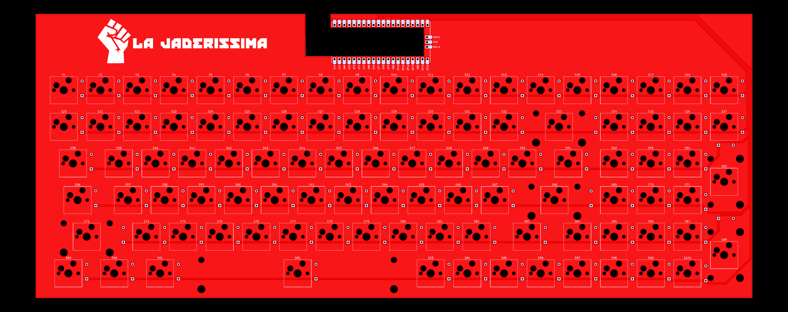
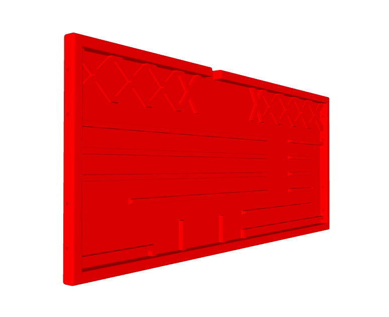
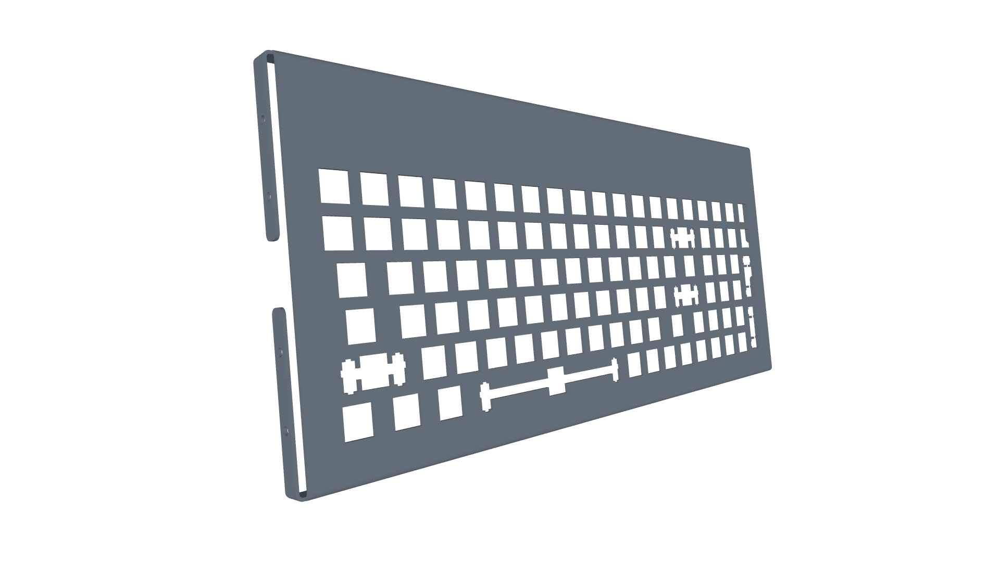

[comment]: <> (Author:  Umberto Laghi)
[comment]: <> (Contact: ul2509@gmail.com)
[comment]: <> (Github:  @ubolakes)

<div align="center">

# :warning: WORK IN PROGRESS :warning:
</div>

# *La Jaderissima* mechanical keyboard
[](LICENSE)

*La Jaderissima* is an open source mechanical keyboard designed with the intent to learn how to design a PCB.  
The repository contains all the materials necessary to build your own *La Jaderissima* at home.

Before introducing the project in more detail, I'd like to thank my friend and colleague, Biagio M., who designed the keyboard case using a 3D CAD software. Without him, I wouldn't have been able to make it.  
He also made the design as thin as possible due to my childish complaints about wanting the keyboard to be as close to the desk as possible.

[comment]: <> (TODO: add image of the final product)

## General overview
The keyboard is designed with a 96% ANSI layout to provide all the necessary keys while reducing the footprint compared to a 100% layout.

<div align="center" style="text-align: center; margin-left: auto; margin-right: auto;">
  

*Figure 1: Mechanical keyboard layout*
</div>

## Case design
The feature I desire most in a keyboard is a thin design that reduces wrist fatigue without the need for a wrist rest. A slimmer keyboard also offers a sleeker look (I guess).

To achieve this, my friend and colleague, Biagio, designed a bent sheet metal backplate and a 3D-printable bottom case in order to reduce costs and make the keyboard lighter. Biagio also designed 3D-printable feet to angle the keyboard and improve ergonomics.

## Keyswitch
Another design choice that makes the keyboard thinner is the use of low-profile switches. It was difficult to choose the most suitable keyswitch.

The first type of switch I chose was the Kailh Choc. The problem with them is that they are a completely custom design. Finding keycaps, stabilizers, and mechanical drawings to understand the dimensions was difficult and expensive.

After my search, I discovered the Outemu GTMX medium-profile switches. They have a lower profile than Cherry MX switches, but not as low as Kailh Choc switches. They have the same footprint as standard Cherry MX switches and are compatible with MX-specific PCBs, backplates, keycaps, and MX PCB-mounted stabilizers, which allows for a lower price.

<div align="center" style="text-align: center; margin-left: auto; margin-right: auto;">
  

*Figure 2: Cherry MX and Outemu GTMX heights compared*
</div>

## How to build your own

### Materials
To build your own _La Jaderissima_ you'll need the following articles, which can be purchased on AliExpress.
To find an item on AliExpress, enter the HTML name after `aliexpress.com/item/` in the search bar of any browser.

<div align="center">

|                    Article                   | Quantity |    AliExpress article    |
|:--------------------------------------------:|:--------:|:------------------------:|
| Kailh hotswap sockets for Cherry MX switches |    100   | 1005009187522252.html    |
| 1N4148 diode                                 |    100   | 1005010146177612.html    |
| Outemu GTMX mechanical switch                |    100   | 1005006959024644.html    |
| Tecsee V3 stabilizers kit                    |     1    | 1005005320528545.html    |
| Raspberry Pi Pico with type-C port           |     1    | 1005008948799927.html    |
| Low profile ANSI keycaps set                 |     1    | 1005008237946422.html    |

*Table 1: Purchase list*
</div>

The switches and stabilizers in the table are specific to a medium-low profile build. Otherwise, any Cherry MX-compatible switches and stabilizers are fine.

The following table lists the mechanical switches and stabilizers that I used for the second La Jaderissima that I built.

<div align="center">

|                    Article                 | Quantity |    AliExpress article    |
|:------------------------------------------:|:--------:|:------------------------:|
| Epomaker Wisteria linear mechanical switch |    100   | 1005005363024093.html    |
| Cherry MX compatible stabilizers kit       |     1    | 1005001686299616.html    |

*Table 2: Alternative Cherry MX switches and stabilizers*
</div>

### PCB

<div align="center" style="text-align: center; margin-left: auto; margin-right: auto;">
  

*Figure 3: Front side of the keyboard PCB*
</div>

You can build a PCB yourself (and it must be red!!) using the files in the .zip folder, which contains everything the fabricator needs.
You can choose any fabricator, since most of them accept source files exported from KiCAD.

Along with the PCB, you will need hotswap sockets for MX switches. I chose the Kailh ones, but I think these are pretty much standardised.

You will also need diodes to prevent current from flowing in the wrong direction and to avoid unintentional clicks. The specific type of diode required is the 1N4148; these are cheap and easy to obtain.

### Switches and stabilizers
You can mount any type of mechanical switch as long as it is MX compatible.
If you are using full-height Cherry MX switches, you can buy any PCB-mounted stabilizer you want since there is no height constraint.

However, things get difficult when looking for medium-to-low-profile Cherry MX-compatible switches. I bought several stabilizer kits, hoping to find the right height, but ended up using the Tecsee V3 stabilizer kit, which is specifically designed for Tecsee medium-to-low switches and it is also compatible with Outemu GTMX switches.

### Keycaps
As long as they use an ANSI layout, you can choose any type of keycap.
I chose a low-profile set to maintain a short profile.

### Case
The case can be 3D-printed in any material or color you prefer.
Since I used a standard 3D printer, I had to split the case into two parts to fit the printer's build plate. I used two 4x16 mm plugs and four 3x16 mm plugs to join them; you can also add glue to better keep the pieces together.

If you have access to a 3D printer with a larger footprint, I included a step file so you can print the case in one piece and avoid using plugs.

<div align="center" style="text-align: center; margin-left: auto; margin-right: auto;">
  

*Figure 4: Mechanical keyboard bottom case*
</div>

Since you are a skilled 3D designer, I also included the CAD file of the keyboard PCB with switches so that you can design your own case with all the features you desire.

To improve ergonomics, I included the CAD files for different sized feet that can be added to the keyboard to create an angle and provide a better typing experience for your wrists.

### Backplate
<div align="center" style="text-align: center; margin-left: auto; margin-right: auto;">
  

*Figure 5: 3D render of the backplate*
</div>

The design I imagined required the keyboard to be short and sleek, which led me to use a 1.5 mm thick stainless steel backplate that embraces the bottom case and is secured to it by eight M3 screws.

This piece can be made using online services, which require a STEP file. However, if you choose to rely on a local fabricator, as I did, I have included a DXF file for laser cutting and a PDF showing where to bend the metal sheet (CAD > 2D).


### MCU
I decided to use a Raspberry Pi Pico as the MCU for the mechanical keyboard because it's inexpensive, can be mounted using connector pins, and has plenty of GPIO to handle the entire keyboard.
While an original RPi Pico is not necessary, as they could be more expensive, any Chinese clone is fine as long as it has the same pinout and an RP2040 MCU.

### Firmware
The firmware was developed using QMK, and it can be flashed on an RP2040 MCU. Otherwise, it would not work.
There are two ways to flash the firmware.

#### Easy route
The firmware is already compiled and available in the `firmware` folder. To flash it in the RP2040, connect the Raspberry Pi Pico in bootloader mode and copy the file in the folder. It will automatically reboot and be seen as a USB peripheral.

#### Hard route
To compile and flash the firmware on your La_Jaderissima keyboard, you need to install the QMK environment. The following steps are specifically for a GNU/Linux operating system (OS). If you are using a different OS, you can follow the specific guide on the QMK website.

1. Install the QMK CLI
```
curl -fsSL https://install.qmk.fm | sh
```
2. Download the fork containing La_Jaderissima firmware
```
qmk setup ubolakes/La_Jaderissima_qmk_firmware
```
3. Connect the RPi Pico via USB and go into bootloader mode
4. Build and flash the firmware on the MCU
```
qmk flash -kb la_jaderissima -km default
```

If everything worked fine you now have a RPi Pico with La_Jaderissima firmware flashed.